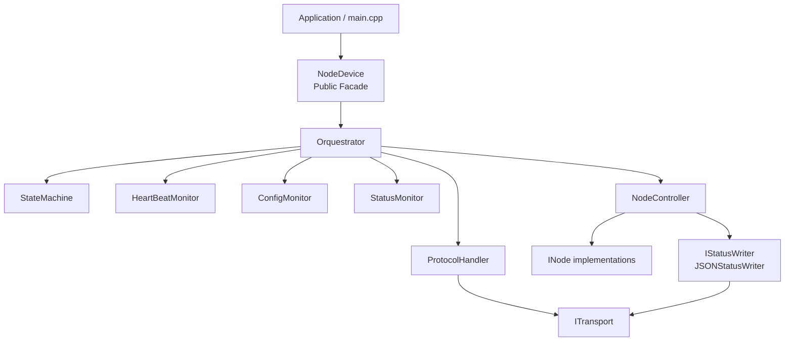

# NodeControl

**Event-driven embedded framework for modular Node-based devices**

NodeControl is a lightweight C++ framework for embedded systems built around a simple idea:

> An application should describe its hardware through Nodes while the framework handles communication, lifecycle, state, commands, events, monitoring and serialization.

The project was initially developed for Arduino-compatible microcontrollers using PlatformIO, with special attention to small devices with limited SRAM.

Instead of building every firmware as a monolithic `loop()` containing serial parsing, state handling, timeouts, hardware control and message formatting, NodeControl separates these responsibilities into small cooperating components.

The result is an architecture where a new application is mainly responsible for:

* defining the device configuration;
* implementing its Nodes;
* instantiating those Nodes;
* registering them with `NodeDevice`;
* calling `begin()`;
* calling `update()` continuously.

The application should not need to reimplement the protocol, state machine, heartbeat, configuration handshake, command routing or status serialization.

---

# Project Status

NodeControl is under active development.

The current architecture already provides:

* reusable `NodeDevice` facade;
* event-driven orchestration;
* finite state machine;
* Host/Device handshake;
* heartbeat supervision;
* periodic status publication;
* compact command protocol;
* GET and SET commands;
* typed command results;
* Node-generated events;
* transport abstraction;
* polymorphic Nodes through `INode`;
* fixed-size receive buffer;
* zero-copy command payload parsing;
* PROGMEM configuration support;
* streaming JSON status serialization;
* RAM-conscious design for AVR-class devices.

The next major architectural component planned for the project is **HostDevice**, which will sit above NodeControl and bridge embedded devices to higher-level systems such as MQTT.

---

# Motivation

A traditional embedded application often evolves toward something like:

```cpp
void loop()
{
    checkSerial();
    parseMessages();

    checkHeartbeat();
    checkTimeouts();

    updateStateMachine();

    readSensors();
    updateOutputs();

    publishStatus();

    processCommands();
}
```

This works for small sketches.

As the application grows, however, unrelated responsibilities begin to depend on each other:

```text
Serial
  ↕
Protocol
  ↕
State
  ↕
Timeouts
  ↕
Sensors
  ↕
Actuators
  ↕
Status
```

Adding a new device may require changes throughout the firmware.

NodeControl separates those responsibilities.

```text
Application
     │
     ▼
 NodeDevice
     │
     ▼
 Orchestrator
     │
 ┌───┼───────────────────────┐
 │   │                       │
 ▼   ▼                       ▼
FSM Protocol              Monitors
 │   │                       │
 └───┴───────────┬───────────┘
                 ▼
           NodeController
                 │
          ┌──────┼──────┐
          ▼      ▼      ▼
        Node   Node   Node
```

The framework coordinates the infrastructure.

The Nodes implement the actual device behavior.

---

# Core Design Principle

A Node should know its own domain.

For example, an LED Node should know:

* which pin controls the LED;
* its current state;
* which properties it exposes;
* how commands affect those properties.

It should **not** need to know:

* how Serial works;
* how messages are framed;
* how JSON is generated;
* how the state machine works;
* how heartbeat works;
* how MQTT works;
* which Host is connected.

This separation is one of the central principles of NodeControl.

---

# Architecture



The architecture is intentionally divided into two conceptual areas:

```text
APPLICATION
──────────────────────────────

main.cpp
DEVICE_CONFIG
LedNode
ButtonNode
RGBNode
TemperatureNode
...

        │
        ▼

PUBLIC FRAMEWORK API
──────────────────────────────

NodeDevice
INode
ITransport
supporting value/event types

        │
        ▼

FRAMEWORK INTERNALS
──────────────────────────────

Orquestrator
NodeController
StateMachine
ProtocolHandler
ConfigMonitor
HeartBeatMonitor
StatusMonitor
JSONStatusWriter
EventEmitter
...
```

A normal application should interact mostly with the upper part of this architecture.

---

# NodeDevice

`NodeDevice` is the public facade of the framework.

Its current public interface is intentionally small:

```cpp
class NodeDevice
{
public:

    explicit NodeDevice(
        ITransport& transport,
        const char* deviceConfig
    );

    void begin();
    void update();

    bool addNode(INode& node);
};
```

Internally, `NodeDevice` owns an `Orquestrator`.

The application therefore does not need to know how the internal components cooperate.

Conceptually:

```text
Application
    │
    ▼
NodeDevice
    │
    └──── hides ────► Orquestrator
                       StateMachine
                       ProtocolHandler
```
